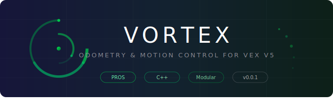

<p align="center">
  
</p>

<p align="center">
  <strong>VEX V5 Odometry Template for PROS</strong>
</p>

<p align="center">
  <a href="https://github.com/VortexLib/Vortex/releases"></a>
  <a href="https://github.com/VortexLib/Vortex/actions/workflows/main.yml"></a>
  <a href="https://github.com/VortexLib/Vortex/blob/main/LICENSE"></a>
  <a href="https://vortexlib.github.io/Vortex/"></a>
</p>

<br/>

## Overview

Vortex is a feature-rich drive template for VEX V5 built on [PROS](https://pros.cs.purdue.edu/). It provides PID control, odometry, pure pursuit path following, and more — ready to use out of the box.

<br/>

## Features

| &nbsp; | Feature | Description |
|:------:|---------|-------------|
| **PID** | Drive, Turn, Swing | Closed-loop control with automatic exit conditions |
| **Odometry** | Position Tracking | Track robot pose with integrated or external encoders |
| **Pure Pursuit** | Path Following | Smooth waypoint-based path following with look-ahead |
| **Boomerang** | Curved Approach | Drive to a target position and arrive at a specific heading |
| **Turn Then Drive** | Two-Phase Motion | Face the target, then drive straight to it |
| **Timed Motions** | Timeout Overloads | Every motion function accepts a timeout — never get stuck |
| **Motion Chaining** | Smooth Transitions | Chain movements together without full stops |
| **Slew Control** | Acceleration Limiting | Smooth ramp-up to prevent wheel slip |
| **Auton Selector** | On-Screen Selection | Touchscreen selector with SD card persistence |
| **PID Tuner** | Live Adjustment | Tune PID constants in real-time from the controller |

<br/>

## Installation

### Depot (Recommended)

```bash
pros c add-depot Vortex https://raw.githubusercontent.com/VortexLib/Vortex/depot/stable.json
pros c apply Vortex
```

### Direct Download

```bash
curl -LO https://github.com/VortexLib/Vortex/releases/latest/download/Vortex@0.0.1.zip
pros c fetch Vortex@0.0.1.zip
pros c apply Vortex
```

<br/>

## Quick Start

### 1. Define your chassis

```cpp
#include "main.h"

vortex::Drive chassis(
  {-5, -6, -7},   // Left motor ports (negative = reversed)
  {8, 9, 10},     // Right motor ports
  11,              // IMU port
  3.25,            // Wheel diameter (inches)
  600,             // Motor cartridge RPM
  1.0              // External gear ratio
);
```

### 2. Set PID constants

```cpp
void default_constants() {
  chassis.pid_drive_constants_set(10.0, 0, 65.0);
  chassis.pid_turn_constants_set(3.0, 0.003, 20.0, 15.0);
  chassis.pid_swing_constants_set(5.0, 0, 35.0);

  chassis.pid_drive_exit_condition_set(300_ms, 1_in, 500_ms, 3_in, 750_ms, 750_ms);
  chassis.pid_turn_exit_condition_set(300_ms, 3_deg, 500_ms, 7_deg, 750_ms, 750_ms);
}
```

### 3. Write autonomous routines

```cpp
void autonomous() {
  default_constants();

  // Drive forward 24 inches, timeout after 2 seconds
  chassis.pid_drive_set(24_in, 110, 2000_ms);

  // Turn to 90 degrees
  chassis.pid_turn_set(90_deg, 110, 1500_ms);

  // Drive to a coordinate using odometry
  chassis.pid_odom_ptp_set({{24, 24}, fwd, 110}, 3000_ms);

  // Pure pursuit path
  chassis.pid_odom_pp_set({
    {{0, 24}, fwd, 110},
    {{24, 24}, fwd, 110},
    {{24, 48}, fwd, 80},
  }, 5000_ms);
}
```

<br/>

## Documentation

Full documentation is available at **[vortexlib.github.io/Vortex](https://vortexlib.github.io/Vortex/)**.

| Guide | Description |
|-------|-------------|
| [Setup](https://vortexlib.github.io/Vortex/setup.html) | Installation and initial configuration |
| [Chassis Setup](https://vortexlib.github.io/Vortex/chassis_setup.html) | Motor ports, tracking wheels, IMU |
| [PID Tuning](https://vortexlib.github.io/Vortex/pid_tuning.html) | How to tune your PID constants |
| [Drive Motions](https://vortexlib.github.io/Vortex/drive_motions.html) | Forward/backward movements |
| [Turn Motions](https://vortexlib.github.io/Vortex/turn_motions.html) | Point turns and turn-to-point |
| [Swing Motions](https://vortexlib.github.io/Vortex/swing_motions.html) | One-sided turns |
| [Odometry](https://vortexlib.github.io/Vortex/odometry.html) | Position tracking system |
| [Odom Motions](https://vortexlib.github.io/Vortex/odom_motions.html) | PTP, boomerang, multi-point |
| [Pure Pursuit](https://vortexlib.github.io/Vortex/pure_pursuit.html) | Path following algorithms |
| [Timed Motions](https://vortexlib.github.io/Vortex/timed_motions.html) | Blocking timeout overloads |
| [Exit Conditions](https://vortexlib.github.io/Vortex/exit_conditions.html) | Configuring when motions end |

<br/>

## Contributing

Contributions are welcome. Please open an [issue](https://github.com/VortexLib/Vortex/issues) or submit a pull request.

<br/>

## License

Vortex is licensed under the [Mozilla Public License 2.0](https://mozilla.org/MPL/2.0/).
